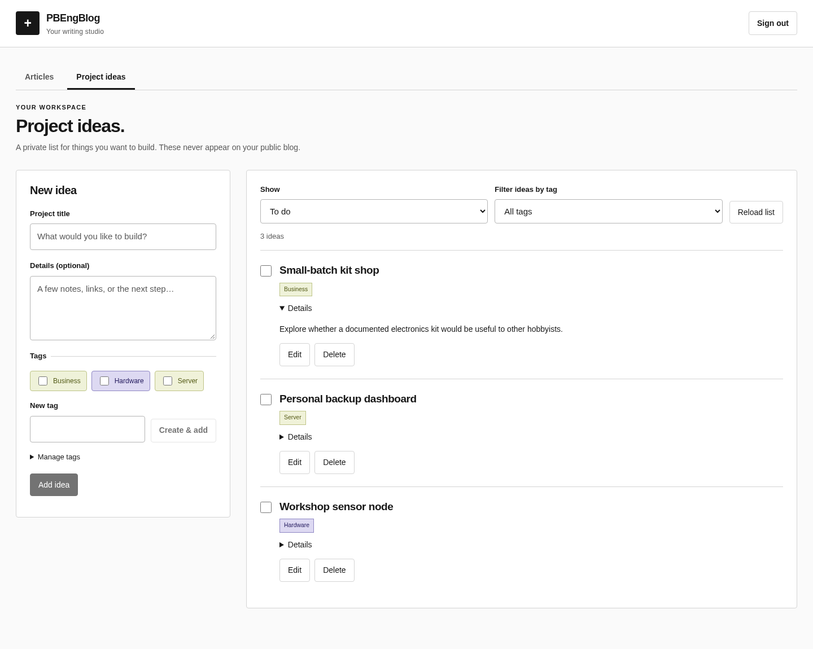

# PBEngBlog

PBEngBlog is a self-hosted blog template with a Notion-like block editor. Paste images, write LaTeX equations, and organize posts with reusable tags. Your website CSS controls formatting, and article headings populate a jump menu. You can write and publish without a Notion account or external CMS.

The template starts with a black-and-white theme and three fictional projects. Change the name and CSS to suit your site.

[](docs/images/homepage-full.png)

## Start locally

Click **Use this template** on GitHub, create a repository, and clone it. Install Node.js 24+, npm, Docker, and Docker Compose.

From your repository root:

```sh
npm ci
cp .env.example .env
```

Edit `.env` before starting:

- Set `POSTGRES_PASSWORD` and use the same password in `DATABASE_URL`. A random hexadecimal password avoids URL-encoding issues.
- Set your own `EDITOR_PASSWORD` and an independent `EDITOR_SESSION_SECRET` (generate the session key with `openssl rand -hex 32`).
- Set `EDITOR_ORIGIN=http://localhost:3011` and open the editor using that exact address.
- Set `SITE_NAME`, `SITE_DESCRIPTION`, `SITE_AUTHOR`, and your eventual public `SITE_URL`.

```sh
docker compose up -d --wait db
npm run db:migrate
npm run dev
```

Open **http://localhost:3011**, sign in, and create an article. The editor and database bind to loopback. Keep `.env` private and out of Git.

To explore the example website in another terminal:

```sh
npm run dev:web
```

Open **http://127.0.0.1:3012** to view the fictional examples. Follow the publishing steps below to build the website from your articles.

## No home server?

Run the editor and database on your laptop while you write or publish. Your static site stays online on Vercel after you shut the laptop down. The release helper requires Linux, including a suitable WSL2 setup.

For an editor you can access at any time, use a Linux cloud server. The **Hetzner CX23** is a budget option, subject to capacity: 2 vCPUs, 4 GB RAM, and a listed EU base price of **€5.49 / US$6.49 per month**, excluding IPv4 and VAT. [Specifications](https://www.hetzner.com/cloud/cost-optimized/) · [Pricing](https://docs.hetzner.com/general/infrastructure-and-availability/price-adjustment/).

**Oracle Cloud Always Free** costs $0 within its eligible compute and storage limits. You may have to wait for capacity, and Oracle can reclaim idle servers. Keep offsite backups. [Oracle's limits and conditions](https://docs.oracle.com/en-us/iaas/Content/FreeTier/freetier_topic-Always_Free_Resources.htm).

See the [backend hosting guide](docs/OPERATIONS.md#backend-hosting-without-a-home-server) for provider comparisons and a step-by-step cloud setup. Prices checked October 2, 2026; confirm the total at checkout. Vercel's free Hobby plan is intended for personal, non-commercial sites within its limits. [Hobby plan](https://vercel.com/docs/plans/hobby).

## Write and organize

- Paste images into the document or use **Upload cover**. PNG, JPEG, WebP, and GIF up to 12 MB are supported.
- Use `/` for headings, lists, and LaTeX equations. Headings populate the article's jump menu.
- Open **Article details** for the URL, category, reusable tags, and optional entry date. Dates accept a year, month, or full date.
- Search and filter your article library. Drafts autosave; **History** restores earlier revisions.
- Click **Save snapshot** to select an article's public version. Deploy it with the release command, or enable the background publisher for **Publish to website**.


## Keep a project ideas list

Open **Project ideas** to keep a private to-do list. Add a title, optional details, and reusable tags such as Server, Hardware, or Business. Click **Add idea** or **Save idea**, check off completed work, and filter by tag or status. Database backups include ideas; website exports exclude them.



## Deploy to Vercel

Host the static website on Vercel and run the editor, PostgreSQL, and image storage on your computer or a Linux server. The published site stays online while the editor is offline.

The included release helper requires Linux, Docker, Python 3, and `flock`. Run it from the machine that holds your database and uploads.

1. Import your repository into a Vercel project with these settings. The included `vercel.json` configures the build and clean article URLs. The first deployment shows the fictional demo.

   | Setting | Value |
   | --- | --- |
   | Root directory | Repository root (`.`) |
   | Framework preset | Other |
   | Install command | `npm ci` |
   | Build command | `npm run build --workspace @pbengblog/web` |
   | Output directory | `apps/web/out` |
   | Node.js version | 24.x |

2. In Vercel's project settings, disconnect the Git repository before publishing your database content. Otherwise a later Git deployment can replace your articles with the demo. Subsequent releases use the helper below.
3. Copy the project ID and name from project settings, and your team ID from team settings. Create a Vercel access token for that team at [account tokens](https://vercel.com/account/tokens). Store the token in a private file on your editor host, outside the repository; restrict it to your user (`chmod 600 /absolute/path/to/vercel-token`).
4. Create the local deployment config:

   ```sh
   mkdir -p .local
   cp docs/deploy-config.example.json .local/deploy-config.json
   chmod 600 .env .local/deploy-config.json
   ```

   Fill in your values; `tokenFile` is a path, not the token itself:

   ```json
   {
     "projectId": "prj_YOUR_PROJECT_ID",
     "projectName": "your-blog",
     "teamId": "team_YOUR_TEAM_ID",
     "tokenFile": "/absolute/path/to/vercel-token"
   }
   ```

5. Set `SITE_URL` in your local `.env` to the final `https://your-blog.vercel.app` address or custom domain. In the editor, click **Save snapshot** for each article you want online. At least one published article is required.
6. Preview, review the returned URL, then publish:

   ```sh
   bash scripts/release.sh
   bash scripts/release.sh --production
   ```

The release helper uploads published snapshots and their website assets. It keeps unpublished edits, the database, and credentials on your host, and reads branding from the local `.env`. Use the same release command to publish later CSS changes.

Add a custom domain under the Vercel project's **Domains** settings and follow its DNS instructions. See Vercel's [project documentation](https://vercel.com/docs/projects) and [build settings](https://vercel.com/docs/builds/configure-a-build) for dashboard details.

For one-click **Publish to website**, follow the optional [background publisher setup](docs/OPERATIONS.md#background-publishing). For an always-running editor or an HTTPS editor domain, follow [continuous hosting](docs/OPERATIONS.md#editor-login-and-continuous-hosting). Both use the existing database and release process.

## Make it yours

| Change | File |
| --- | --- |
| Site name, description, author, URL | `.env` (`SITE_*`) |
| Shared colors, fonts, and corner radius | `shared/template-theme.css` |
| Website layout and card styling | `apps/web/app/monochrome.css` |
| Homepage content and layout | `apps/web/app/page.tsx` |
| Header, navigation, and footer | `apps/web/app/layout.tsx` |
| Editor layout and controls | `apps/editor/app/editor.css` |
| Base article/block formatting | `shared/theme.css` |
| Fictional preview content | `shared/demo.ts` |

Start with the CSS variables in `shared/template-theme.css`; both the editor and public website use them. For example, change `--accent` and `--accent-hover` for buttons, `--bg` for the page background, or `--sans` for the font. Keep foreground and background colors legible together.

Replace the generated demo covers with your own images as you create articles. See [asset details and prompts](apps/web/public/demo/GENERATED-IMAGES.md) for their provenance. Published builds read your database snapshots.

## Storage and maintenance

PostgreSQL stores articles, tags, revisions, published snapshots, and private ideas. Find uploads in `.local/uploads/` and releases in `.local/releases/`. Git excludes this data. Back up the database and uploads with:

```sh
bash scripts/backup.sh
```

Keep an offsite copy of backups. See [Operations](docs/OPERATIONS.md) for restores, continuous hosting, publishing recovery, and updates; [Architecture](docs/ARCHITECTURE.md) describes the components.

For development checks:

```sh
npm run typecheck
npm test
npm run build
```

## Development attribution

OpenAI Codex generated all code in this project. Humans made all architectural and design decisions.

## License

The application code uses the MIT license. Dependencies keep their own licenses; BlockNote core and its math package use MPL-2.0. The template requires no XL packages. The application license does not cover your articles or media.
