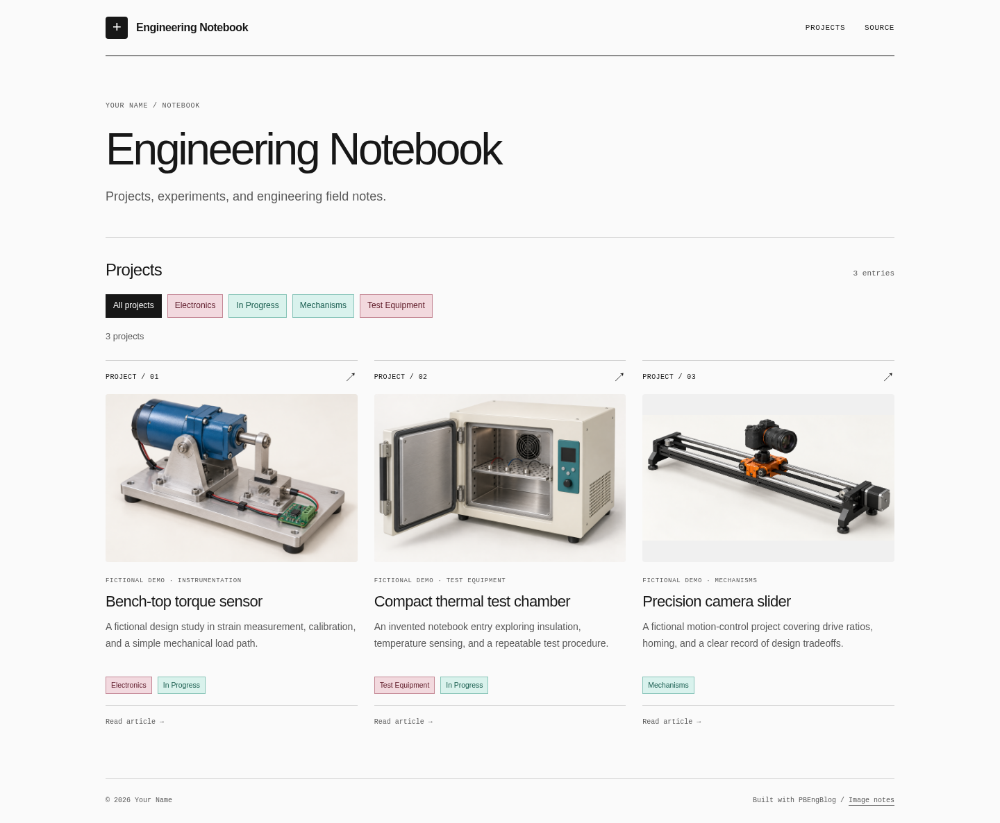
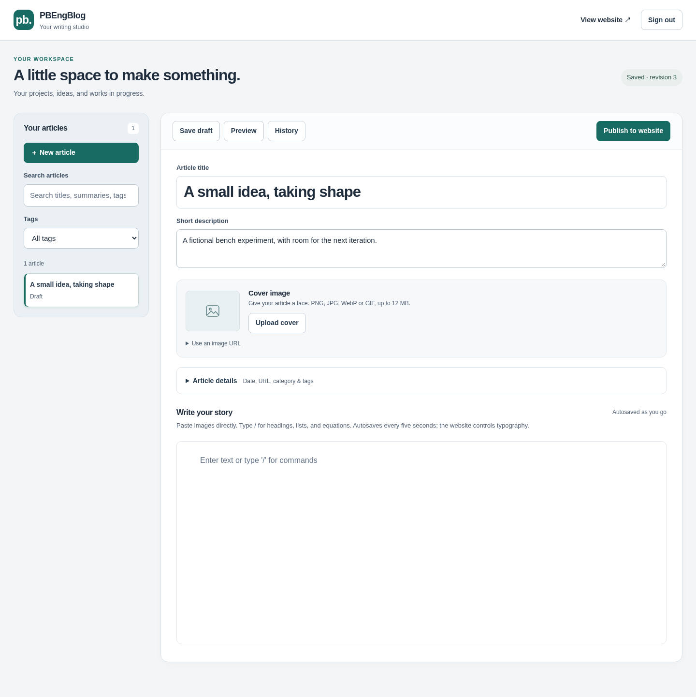

# PBEngBlog

A standalone, self-hosted blog template with a block editor, image pasting, LaTeX equations, reusable tags, and automatic heading navigation. Write in the editor; let your website CSS handle the formatting. No Notion account or external CMS is needed.

The default design is a simple black-and-white starting point. Change the name, colors, fonts, and layout to make it your own. Three fictional projects demonstrate articles, images, and equations.

[](docs/images/homepage-full.png)

## Start locally

Use **Use this template** on GitHub to create your own repository, then clone it. Install Node.js 24+, npm, Docker, and Docker Compose.

From your repository root:

```sh
npm ci
cp .env.example .env
```

Edit `.env` before starting:

- Set `POSTGRES_PASSWORD` and use the same password in `DATABASE_URL`. A random hexadecimal password avoids URL-encoding issues.
- Set your own `EDITOR_PASSWORD` and an independent `EDITOR_SESSION_SECRET` (generate the session key with `openssl rand -hex 32`).
- Set `EDITOR_ORIGIN=http://localhost:3011` and open the editor using that exact address.
- Set `SITE_NAME`, `SITE_DESCRIPTION`, `SITE_AUTHOR`, and your eventual public `SITE_URL`.

```sh
docker compose up -d --wait db
npm run db:migrate
npm run dev
```

Open **http://localhost:3011**, sign in with your editor password, and create your first article. The database and editor listen only on this machine. Keep `.env` private and out of Git.

To explore the example website in another terminal:

```sh
npm run dev:web
```

Open **http://127.0.0.1:3012**. This preview shows the fictional examples; your saved articles enter the website through publishing below.

## No home server?

You can run the editor and database on your own laptop and only start them when writing or publishing. The static site stays online on Vercel after your laptop shuts down. The included release helper runs on Linux (including a suitable WSL2 setup).

For an always-on backend, a small cloud Linux server runs the same setup. A **Hetzner CX23** is our low-cost recommendation when available: 2 vCPUs, 4 GB RAM, and a listed EU base price of **€5.49 / US$6.49 per month**, excluding IPv4 and VAT. [Specifications](https://www.hetzner.com/cloud/cost-optimized/) · [Pricing](https://docs.hetzner.com/general/infrastructure-and-availability/price-adjustment/).

**Oracle Cloud Always Free** is a $0 alternative within its eligible compute/storage limits, but capacity can be unavailable and idle servers can be reclaimed. It is an option for patient tinkerers with offsite backups. [Oracle's limits and conditions](https://docs.oracle.com/en-us/iaas/Content/FreeTier/freetier_topic-Always_Free_Resources.htm).

See the [backend hosting guide](docs/OPERATIONS.md#backend-hosting-without-a-home-server) for provider comparisons and a step-by-step cloud setup. Prices checked October 2, 2026; confirm the total at checkout. Vercel's free Hobby plan is intended for personal, non-commercial sites within its limits. [Hobby plan](https://vercel.com/docs/plans/hobby).

## Write and organize

- Paste images into the document or use **Upload cover**. PNG, JPEG, WebP, and GIF up to 12 MB are supported.
- Use `/` for headings, lists, and LaTeX equations. Headings automatically populate the article's jump menu.
- Open **Article details** for the URL, category, reusable tags, and optional entry date. Dates accept a year, month, or full date.
- Search and filter your article library. Drafts autosave; **History** restores earlier revisions.
- Click **Save snapshot** when an article is ready for publication. This saves its public version; deploying it is a separate step unless you enable the background publisher.



## Deploy to Vercel

Vercel hosts the public static website. Run the editor, PostgreSQL, and persistent image storage on your computer or a Linux server. The published website stays online when your editor is offline. This setup does not deploy the editor or database to Vercel.

The included release helper requires Linux, Docker, Python 3, and `flock`. Run it from the machine that holds your database and uploads.

1. Create a Vercel project for your blog. One way to initialize it is to import your repository with the settings below; the included `vercel.json` supplies the build settings and clean article URLs. The first deployment shows the fictional demo.

   | Setting | Value |
   | --- | --- |
   | Root directory | Repository root (`.`) |
   | Framework preset | Other |
   | Install command | `npm ci` |
   | Build command | `npm run build --workspace @pbengblog/web` |
   | Output directory | `apps/web/out` |
   | Node.js version | 24.x |

2. In Vercel's project settings, disconnect the Git repository before publishing your database content. Otherwise a later Git deployment can replace your articles with the demo. Subsequent releases use the helper below.
3. Copy the project ID and name from project settings, and your team ID from team settings. Create a Vercel access token for that team at [account tokens](https://vercel.com/account/tokens). Store the token in a private file on your editor host, outside the repository; restrict it to your user (`chmod 600 /absolute/path/to/vercel-token`).
4. Create the local deployment config:

   ```sh
   mkdir -p .local
   cp docs/deploy-config.example.json .local/deploy-config.json
   chmod 600 .env .local/deploy-config.json
   ```

   Fill in your values; `tokenFile` is a path, not the token itself:

   ```json
   {
     "projectId": "prj_YOUR_PROJECT_ID",
     "projectName": "your-blog",
     "teamId": "team_YOUR_TEAM_ID",
     "tokenFile": "/absolute/path/to/vercel-token"
   }
   ```

5. Set `SITE_URL` in your local `.env` to the final `https://your-blog.vercel.app` address or custom domain. In the editor, click **Save snapshot** for each article you want online. At least one published article is required.
6. Preview, review the returned URL, then publish:

   ```sh
   bash scripts/release.sh
   bash scripts/release.sh --production
   ```

Only published snapshots and their website assets are uploaded. Unpublished edits, your database, editor password, and deployment credentials stay on your host. Branding is read from the local `.env` during release builds. Later CSS changes go live through the same release command.

Add a custom domain under the Vercel project's **Domains** settings and follow its DNS instructions. See Vercel's [project documentation](https://vercel.com/docs/projects) and [build settings](https://vercel.com/docs/builds/configure-a-build) for dashboard details.

For one-click **Publish to website**, follow the optional [background publisher setup](docs/OPERATIONS.md#background-publishing). For an always-running editor or an HTTPS editor domain, follow [continuous hosting](docs/OPERATIONS.md#editor-login-and-continuous-hosting). These use the same database and release process.

## Make it yours

| Change | File |
| --- | --- |
| Site name, description, author, URL | `.env` (`SITE_*`) |
| Shared colors, fonts, and corner radius | `shared/template-theme.css` |
| Website layout and card styling | `apps/web/app/monochrome.css` |
| Homepage content and layout | `apps/web/app/page.tsx` |
| Header, navigation, and footer | `apps/web/app/layout.tsx` |
| Editor layout and controls | `apps/editor/app/editor.css` |
| Base article/block formatting | `shared/theme.css` |
| Fictional preview content | `shared/demo.ts` |

Start with the CSS variables in `shared/template-theme.css`; both the editor and public website use them. For example, change `--accent` and `--accent-hover` for buttons, `--bg` for the page background, or `--sans` for the font. Keep foreground and background colors legible together.

The demo illustrations are generated concepts. [Asset details and prompts](apps/web/public/demo/GENERATED-IMAGES.md) are included. Replace them with your own covers as you create articles. Published builds use your database snapshots, not the demo entries.

## Storage and maintenance

PostgreSQL stores articles, tags, revision history, and published snapshots. Uploaded image files live in `.local/uploads/`; releases live in `.local/releases/`. These are excluded from Git, so copying the repository alone does not back up your blog.

```sh
bash scripts/backup.sh
```

Keep an offsite copy of backups. See [Operations](docs/OPERATIONS.md) for restores, continuous hosting, publishing recovery, and updates; [Architecture](docs/ARCHITECTURE.md) describes the components.

For development checks:

```sh
npm run typecheck
npm test
npm run build
```

## Development attribution

All code in this project was generated using OpenAI Codex. All architectural and design decisions were made by humans.  

## License

Application code is MIT licensed. Dependencies retain their own licenses; BlockNote core and its math package are MPL-2.0. No XL packages are required. Your articles and media remain separate from the application's code license.
