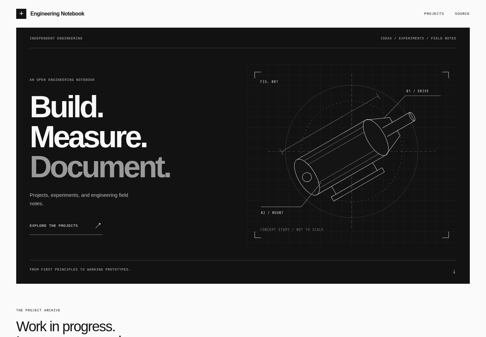
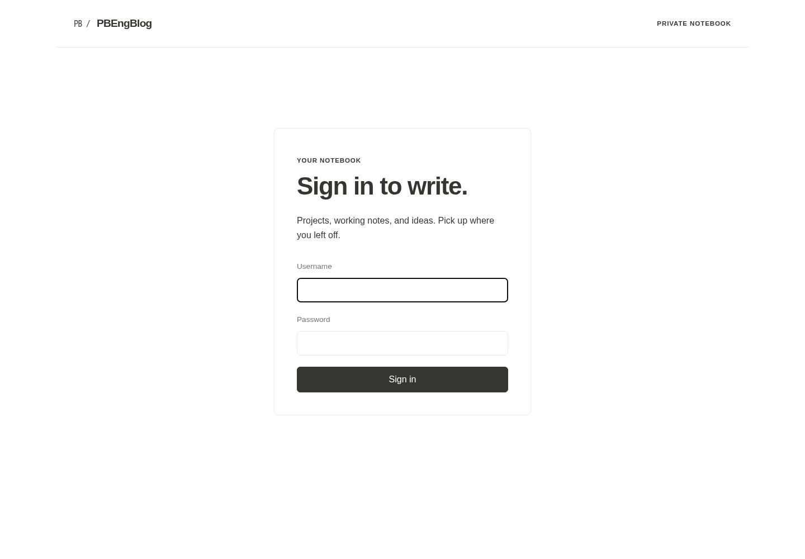

# PBEngBlog

A self-hosted engineering blog with a Notion-style BlockNote editor, LaTeX equations, image pasting, and automatic article navigation.

The template includes three clearly labeled fictional projects: a torque sensor, a thermal chamber, and a camera slider. The website uses a bold black-and-white engineering theme with an original technical drawing, numbered project cards, and readable article layouts. The editor keeps its neutral document theme. Site branding is configurable; personal content and custom themes belong in your own repository.

## Homepage preview

[](docs/images/homepage-full.png)

The fictional projects use generated color concept illustrations. See [image details and generation prompts](apps/web/public/demo/GENERATED-IMAGES.md).

## Architecture

- **Editor:** Next.js and BlockNote, protected by single-owner session login. Use HTTPS for public access or an SSH tunnel for private access.
- **Storage:** PostgreSQL 17 stores drafts, immutable revision snapshots, published snapshots, and image metadata. Image bytes live in persistent local storage.
- **Website:** A separate Next.js static export. Publishing copies only published articles and their images into an immutable release; readers never connect to your database or editor.
- **Migration:** A one-time importer for public `nextjs-notion-starter-kit` sites. The running blog has no Notion dependency.

The optional background publisher deploys to Vercel directly from the editor. A manual release command is also included. The editor supports single-owner session login and optional public HTTPS routing; see [Operations](docs/OPERATIONS.md).

## Start locally

Requires Node 24+, npm, Docker, and Docker Compose.

```sh
npm ci
cp .env.example .env
# Set unique random database and editor passwords in .env (editor: 20+ characters).
docker compose up -d --wait db
npm run db:migrate
npm run db:seed
npm run dev
```

Open `http://127.0.0.1:3011` and sign in with the credentials in `.env`. The database binds only to `127.0.0.1:5544`. The editor binds only to `127.0.0.1:3011`.

If Node is unavailable on Linux, `bash scripts/node.sh npm ci` and `bash scripts/node.sh npm run dev` use the existing Node Docker image with your uid/gid. The helper uses host networking to reach the loopback database.

For the monochrome website demo, run `npm run dev:web` and open `http://127.0.0.1:3012`.

## Write and publish

Enable the [background publisher](docs/OPERATIONS.md#background-publishing) for **Publish to website**: save and deploy with one click, watch progress, and close the browser while the host finishes. Without it, use the manual steps below. Search titles, summaries and tags in the sidebar; **History** restores an earlier revision as a new draft. Sign out is in the header.

Set an optional **Entry date** (year, month or full date) to show when a project was made independently of later edits. Tags have consistent colors across the editor and website.

Use headings and blocks; the website supplies fonts, spacing, and colors. Paste PNG, JPEG, WebP, or GIF images (up to 12 MB) directly into the editor. Use `/` to insert inline or display equations.

Create reusable tags in the editor, assign several to each article, and filter the article list by tag. The public project archive has tag filters with shareable URLs. Tag names are case-insensitively unique; rename them under **Manage tags**. Renames update draft labels, while published snapshots and revision history keep their saved labels until republished or restored. Each article supports up to 30 tags.

Drafts autosave every five seconds. Saves use optimistic version checks to prevent another tab from overwriting your edits. History restores a revision into the draft; saving creates a new revision. Published URLs are permanent in this version.

1. Save and preview an article.
2. Choose **Save snapshot** to save its published version in PostgreSQL.
3. Run `npm run publish` to export published content and checksum-verified media to `.local/releases/`.
4. Run `npm run build:published` to create `apps/web/out/`.
5. Review and deploy that output to your static host. For the complete Vercel flow, configure `.local/deploy-config.json` as described in [operations](docs/OPERATIONS.md), then use `bash scripts/release.sh --production`.

A normal `npm run build --workspace @pbengblog/web` builds the generic demo. It never reads private drafts. An explicit empty published snapshot builds an empty website.

Generated releases, uploads, credentials, migration archives, and site output are ignored by Git. The public template does not contain a user's posts. Back them up separately.

## Migration and operations

See [migration](docs/MIGRATION.md), [operations](docs/OPERATIONS.md), and [architecture](docs/ARCHITECTURE.md).

```sh
npm run typecheck
npm test
npm run test:db
npm run build
```

The database integration test creates uniquely named temporary posts and removes only its own test records. It checks concurrent writes, revision retention, URL protection, and draft/published isolation.

## License

PBEngBlog application code is MIT licensed. Dependencies retain their own licenses; BlockNote core and its math package are MPL-2.0. No XL packages are required. Imported articles and media are not covered by the code license.


## Editor login

The self-hosted editor includes a login page, 12-hour sessions, and persistent login throttling. Configure your own credentials and session key, run migrations, and open `/login`. Optional HTTPS-domain deployment and continuous Docker hosting are covered in [Operations](docs/OPERATIONS.md#editor-login-and-continuous-hosting).



The editor includes direct cover-image uploads, collapsible article details, clear light-theme controls, and a password-only login. Completed publishing notifications disappear automatically; **View website** stays in the header.


